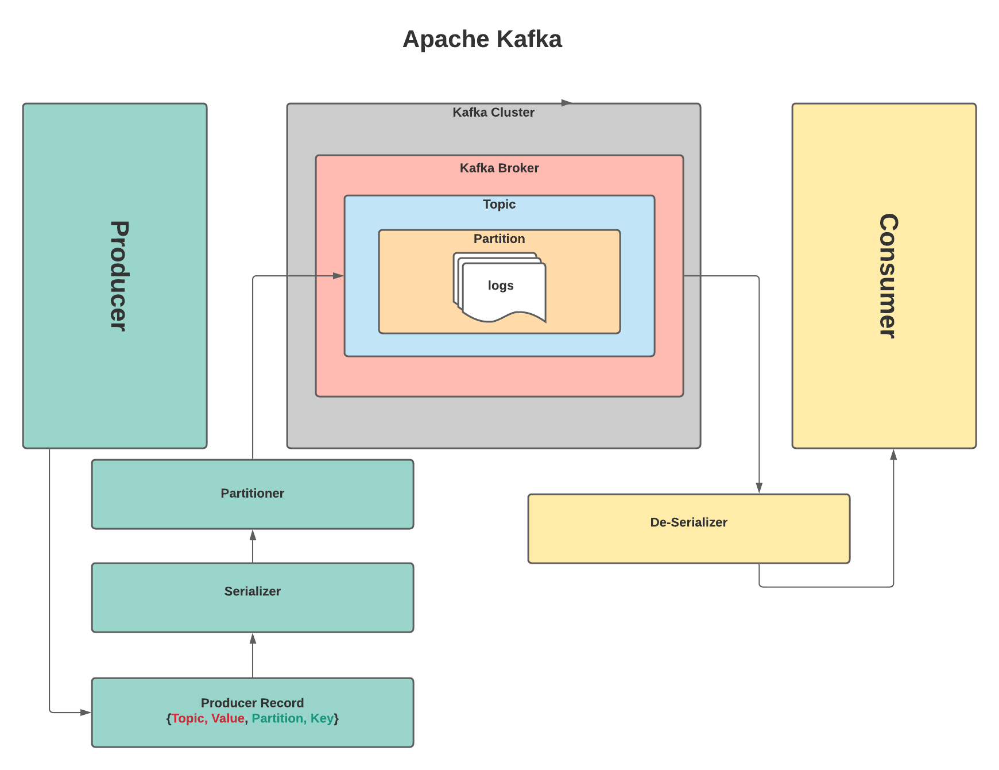

Apache Kafka tutorial for beginners.

# Apache Kafka Architecture

# Install Apache Kafka on Windows

<ol>
<li>Install Java8, skip this step if java already installed, for checking java version ==> open cmd ==> java -version</li>
<li>Download the [Apache Zookeeper](https://zookeeper.apache.org/releases.html). </li>
<li>Download the [Apache Kafka](https://kafka.apache.org/downloads) ==> Note:  choose binary downloads</li>
<li>Unzip both the Zookeeper and Kafka packages using 7-Zip or any unzip tool</li>
<li>Rename both the Zookeeper and Kafka packages</li>
<li>Change the Zookeeper config ==> go to folder config ==> copy the zoo_sample.cfg and rename it to zoo.cfg ==> open zoo.cfg and change dataDir </li>    
<li>Start Zookeeper Server ==>  zookeeper\bin\zkServer.cmd</li>
<li>Start Kafka Broker ==>  kafka\bin\windows\kafka-server-start.bat  ../config/server.properties</li>  
</ol>

